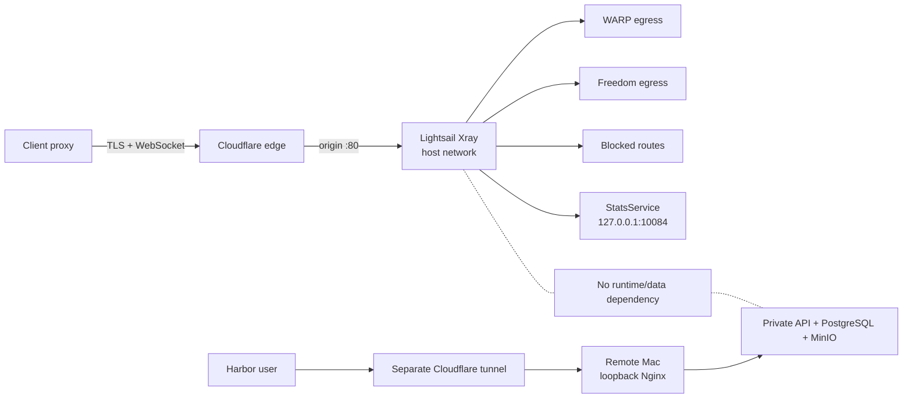
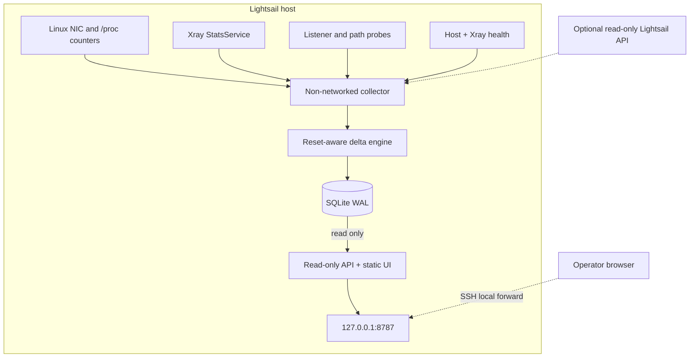
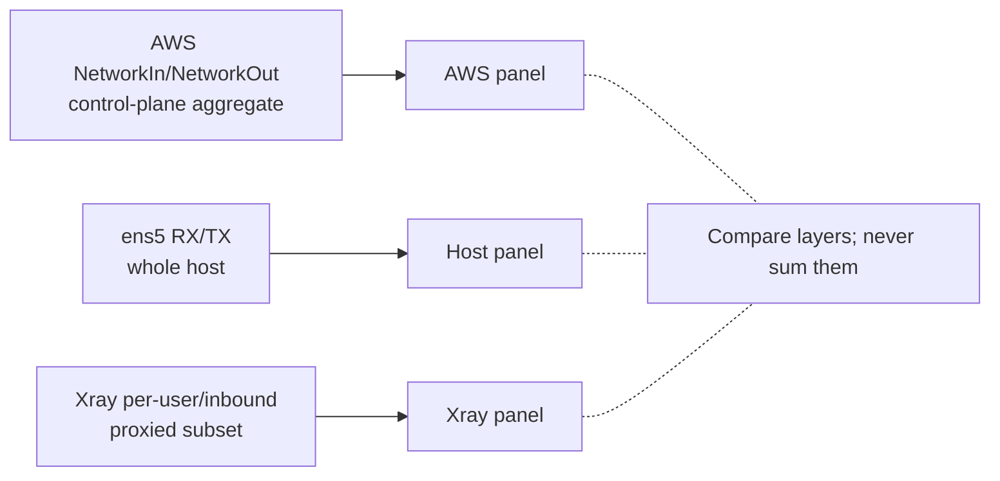
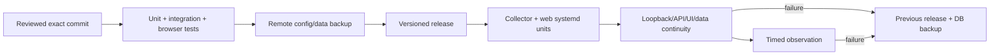

# Grounded architecture

Baseline: 2026-07-15. Secrets and private client identifiers are deliberately
excluded.

## What exists now

The live AWS host is a Lightsail `t3.micro` in `ap-southeast-1` with two vCPU,
approximately 1 GB RAM, and a 40 GB root disk. One host-networked Xray container
provides a VMess/WebSocket public path and WARP/freedom egress. Xray's
StatsService is loopback-only. No Prometheus, Grafana, Loki, node-exporter, or
cAdvisor service was found during the read-only audit.

The Harbor Market application is a separate workload on Jennifer's remote Mac.
It is published by an outbound Cloudflare connector to a loopback Nginx
frontend. Harbor's PostgreSQL and MinIO remain private and are not dependencies
of the AWS proxy.

## Monitor design

The monitored host has limited memory and no swap, so the primary design uses
standard-library Python and SQLite rather than a full observability stack.

The collector and site are different trust zones:

| Component | May access | Must not access |
| --- | --- | --- |
| Collector | Host counters, narrow Xray query, writable ledger | Public HTTP, dashboard password, Xray mutation |
| Web/API | Read-only ledger, static assets, loopback socket | Docker, root, Xray API, AWS writes |
| AWS adapter | Read-only Lightsail metrics/status/firewall | Port changes, instance lifecycle, billing mutations |

Docker-group membership is root-equivalent. If querying Xray requires
`docker exec`, only the collector user receives that membership. The web user
must never receive it.

## Network and accounting relationship

- NIC counters cover Xray, SSH, updates, monitoring, protocol overhead, and all
  other instance traffic.
- Xray counters attribute the proxied subset and reset on Xray restart.
- AWS metrics are the control-plane view and are the correct reconciliation
  layer when account access exists.
- Exact bytes by destination hostname are not available from stock Xray access
  logs. The dashboard promises exact layer totals and connection-path counts,
  not packet-level or hostname-level byte accounting.

## Runtime and rollback pattern

Deploying the monitor must not restart or reconfigure Xray. Every release uses
an exact Git commit and keeps a rollback target. The only added listener is on
loopback. A restart test must demonstrate that the ledger continues while
reset-aware counters remain non-negative.

## Reuse for the remote Mac

The same separation can later monitor the Mac, replacing collectors as
follows:

| AWS host | Remote Mac |
| --- | --- |
| `/sys/class/net` | `netstat -ib` interface counters |
| systemd | launchd |
| Docker/Xray health | Colima/Compose/Harbor health |
| Lightsail metrics | Cloudflare Tunnel and Mac metrics |
| Xray stats | Nginx/API/PostgreSQL/MinIO health |

The Mac monitor should also remain loopback/private. It must not publish raw
Harbor API, PostgreSQL, MinIO, Docker, or macOS administration ports.
